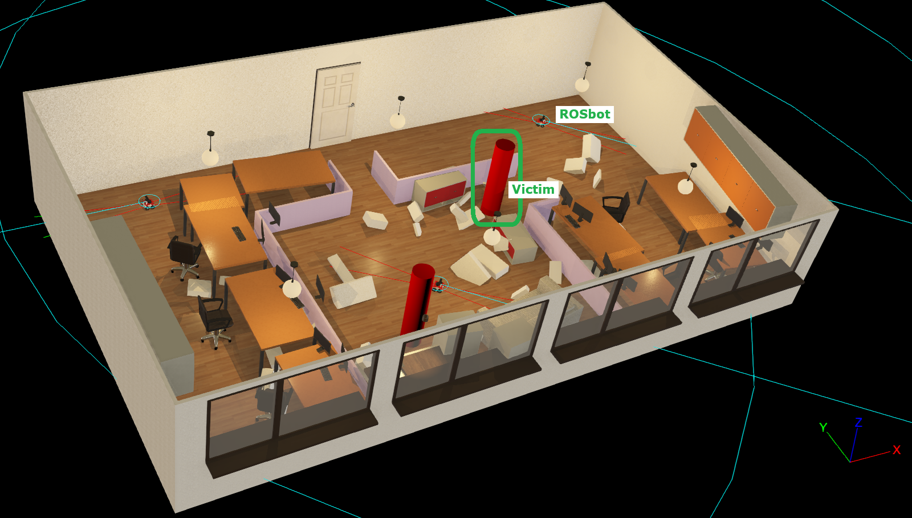

# IEEE SMC Society Artificial Intelligence (AI)-empowered Human-Machine Interaction Competition: Phase 1 

This is the official repository for Phase 1 of the 2025 IEEE Systems, Man, and Cybernetics Society (SMCS) AI-empowered Human-Machine Interaction Competition. This is an open-source competition focusing on search and rescue (SAR) challenges. Specifically, in Phase 1, teams will develop search and rescue strategies to coordinate a fleet of mobile robots searching for victims in simulation environments. The top three teams of Phase 1 will move to Phase 2 competition on implementation and demonstration with real robots. 

**Contents:**

- [Objectives of Phase 1](#objectives-of-phase-1)
- [Simulation Environment Installation](#simulation-environment-installation)
- [Controller Development Guide](#controller-development-guide)
  - [Wheel Motors](#wheel-motors)
  - [Wheel Position Sensors](#wheel-position-sensors)
  - [RGB + Depth Camera](#rgb--depth-camera)
  - [Lidar Sensor](#lidar-sensor)
  - [GPS](#gps)
  - [IMU](#imu)
  - [Distance Sensors](#distance-sensors)
  - [Communication Devices](#communication-devices)
- [Marking Criteria](#marking-criteria)
- [Submission Guidelines](#submission-guidelines)
- [Constraints](#constraints)
- [Tips](#tips)

**IMPORTANT**: For any technical questions raise an issue on this repository and we will get back to you.

# Objectives of Phase 1

Teams must design autonomous agents controlling a fleet of 3 ground robots in a Webots simulation environment. During simulations, the agents (robots) must explore, locate victims and generate mission reports. Crucially, the agents must collaborate with a simulated human supervisor that must authorise all intended actions before they are executed. When the simulated human supervisor rejects a proposed action, the agents must re-plan and propose an alternative. All proposed actions must be justified with natural language explanations sent to the simulated human supervisor. 

In short, your proposed search and rescue strategy must:

- Coordinate a fleet of 3 agents (robots) to divide exploration efficiently 
- Express intended actions with short natural language descriptions alongside justifications for the actions. For example:

```json
{
  "proposed_action": "circumvent debris pile ahead",
  "justification": "check if there is a victim behind the pile"
}
```

- Listen to human supervisor overrides and re-plan when a proposed action is declined.

Using the files, instructions, and examples in this repository, you will be able to develop your search and rescue strategies to satisfy these requirements. Then, at the end of Phase 1, you will [submit your solution](#submission-guidelines) for judging on unseen simulation scenarios. All solutions will be published as open-source software after the competition.

# Simulation Environment Installation

The simulation environments to be used during Phase 1 are developed in Webots, an open-source multi-platform robot simulation environment. This repository contains three worlds on which participants should develop and test their solutions. A few useful examples are included to help you get started. Please follow these steps to set up the development environment:

1. Download and install [Webots R2025a](https://www.cyberbotics.com/#download).
2. Download and install [Python 3](https://www.python.org/downloads/) (if it is not already on your machine). Note: it is possible to use other programming languages to write robot controllers for Webots; however, in this competition, we require participants to use Python in order to facilitate final marking.
3. Clone this repository.

```bash
git clone https://github.com/IEEE-SMCS/ieee-smcs-sar-competition-phase-1.git
```

4. Create a virtual python development environment. By default, Webots uses the system's Python installation.

```bash
cd <path to cloned repo>
python -m venv .venv
.venv/Scripts/activate # to activate
pip install numpy pillow requests # necessary packages for running our examples
```
**Important**: Make sure that your development environment contains the `requests` module (`pip install requests`). This module is necessary for the simulated human supervisor to communicate with the marking server.

5. Configure Webots to use the created `.venv`. Open Webots, then navigate to `Tools > Preferences > General` and modify the `Python command` field. For instance, in Windows, set it to `<path to cloned repo>/.venv/Scripts/python.exe`. You may now install any dependencies that you want to use in that virtual environment. To submit your solution, you will need to provide a reliable means to replicate this environment as outlined in the [submission section](#submission-guidelines).
6. (optional) Configure your IDE for development. For example, in VSCode ensure that your `.vscode/settings.json` file contains the lines below. This will enable all the auto-complete functionality for the Webots Python API.

```json
{
  "python.analysis.extraPaths": [
    "C:/Program Files/Webots/lib/controller/python" // Adjust path for your OS and Webots version
  ]
}
```

7. Test the installation. From the Webots UI, `File > Open World`, browse for `<path to cloned repo>/worlds/basic_example.wbt`, open it and run the simulation. Look at the console output. You should see print statements with sensor information from the robot in this simulation. There should be no errors.

# Controller Development Guide

In the simulation you will be controlling a fleet of 3 ROSbots. At the beginning of a simulation, the ROSbots start from fixed positions and there are victims scattered around the world (environment). Victims are represented by red cylinders as seen on the image below. To successfully score points for finding a victim, you must identify their location, **drive close to them (< 1.0m)** with any of the robots in the fleet and let the simulated human supervisor know that you have found a victim once a robot is standing next to it. Once a victim has been marked as found, no more points are awarded for finding the same victim again. The maximum world size is 25 x 25 m.


There are three practice worlds included here where you may test and develop your solution: `worlds/SAR_small_disaster.wbt`, `worlds/SAR_medium_disaster.wbt`, and `worlds/SAR_large_disaster.wbt`. The ROSbots in these simulations are configured to look for the controller in `controllers/proposed_solution/proposed_solution.py`, you should develop all your code in the `proposed_solution` folder and your main control loop should be in `proposed_solution.py`. It is crucial that you adhere to these instructions for the final automated marking to work correctly.

To get you started, the remainder of this section contains a list of the sensors and actuators available on ROSbot along with links to documentation, `.proto` files, and Python examples on how to use the devices. A comprehensive example of how to access and use all of the sensors and actuators can be found in the file `rosbot_sensors_actuators_example.py` located in the `controllers/rosbot_sensors_actuators_example` folder.

- [ROSbot Docs](https://webots.cloud/run?version=R2025a&url=https%3A%2F%2Fgithub.com%2Fcyberbotics%2Fwebots%2Fblob%2Freleased%2Fprojects%2Frobots%2Fhusarion%2Frosbot%2Fprotos%2FRosbot.proto)
- The custom ROSbot `.proto` file used in simulations is located at `./protos/ROSbot.proto`

**IMPORTANT**: Make sure to read the [Communication Devices](#communication-devices) section to understand how to communicate with the simulated human supervisor in the simulation. Failure to send the correct message format will prevent you from scoring points. It is also important to know the supervisors response format in order to react appropriately pertaining to approved or rejected actions.

### Wheel Motors

ROSbot has one motor per wheel for a total of four. The motor names are `fl_wheel_joint` for the front left wheel, `fr_wheel_joint` for the front right wheel, `rl_wheel_joint` for the rear left wheel, and `rr_wheel_joint` for the rear right wheel.

- [Docs for RotationalMotor](https://www.cyberbotics.com/doc/reference/rotationalmotor?version=R2025a) and see also [Docs for Motor](https://www.cyberbotics.com/doc/reference/motor?version=R2025a)
- [Motor Python API](https://github.com/cyberbotics/webots/blob/released/lib/controller/python/controller/motor.py)

Example usage

```python
from controller import Robot
rosbot = Robot()
front_left_motor = rosbot.getDevice("fl_wheel_joint")
front_left_motor.setPosition(float("inf"))
front_left_motor.setVelocity(1.0)
```

### Wheel Position Sensors

Each wheel has a corresponding position sensor that can measure the wheel’s rotation. The sensor names are `front left wheel motor sensor`, `front right wheel motor sensor`, `rear left wheel motor sensor`, and `rear right wheel motor sensor`.

- [Docs for PositionSensor](https://www.cyberbotics.com/doc/reference/positionsensor?version=R2025a)
- [PositionSensor Python API](https://github.com/cyberbotics/webots/blob/released/lib/controller/python/controller/position_sensor.py)

Example usage

```python
from controller import Robot
rosbot = Robot()
fl_sensor = rosbot.getDevice("front left wheel motor sensor")
fl_sensor.enable(rosbot.getBasicTimeStep())
value = fl_sensor.getValue()
print("Front left wheel position:", value)
```

### RGB + Depth Camera

ROSbot has a forward-facing Astra camera which outputs RGB and depth images. This device comprises a Webots camera and range finder.

- [Docs for Orbbec Astra](https://webots.cloud/run?version=R2025a&url=https%3A%2F%2Fgithub.com%2Fcyberbotics%2Fwebots%2Fblob%2Freleased%2Fprojects%2Fdevices%2Forbbec%2Fprotos%2FAstra.proto)
- [Orbbec Astra proto file](https://github.com/cyberbotics/webots/blob/released/projects/devices/orbbec/protos/Astra.proto)
- [Docs for Camera](https://www.cyberbotics.com/doc/reference/camera?version=R2025a)
- [Camera Python API](https://github.com/cyberbotics/webots/blob/released/lib/controller/python/controller/camera.py)
- [Docs for RangeFinder](https://www.cyberbotics.com/doc/reference/rangefinder?version=R2025a)
- [RangeFinder Python API](https://github.com/cyberbotics/webots/blob/released/lib/controller/python/controller/range_finder.py)

Example usage

```python
from controller import Robot
rosbot = Robot()
rgb_camera = rosbot.getDevice("camera rgb")
rgb_camera.enable(rosbot.getBasicTimeStep())
image = rgb_camera.getImage()
print("Captured RGB image size:", rgb_camera.getWidth(), rgb_camera.getHeight())
print("Captured RGB image:", image)

depth_camera = rosbot.getDevice("camera depth")
depth_camera.enable(rosbot.getBasicTimeStep())
depth = depth_camera.getRangeImage()
print("Depth image: ", depth)
```

### Lidar Sensor

ROSbot is equipped with an RpLidarA2. This device comprises a Webots Lidar named `laser`.

- [Docs for RpLidarA2](https://webots.cloud/run?version=R2025a&url=https%3A%2F%2Fgithub.com%2Fcyberbotics%2Fwebots%2Fblob%2Freleased%2Fprojects%2Fdevices%2Fslamtec%2Fprotos%2FRpLidarA2.proto)
- [RpLidarA2 proto](https://github.com/cyberbotics/webots/blob/released/projects/devices/slamtec/protos/RpLidarA2.proto)
- [Docs for Lidar](https://www.cyberbotics.com/doc/reference/lidar?version=R2025a)
- [Lidar Python API](https://github.com/cyberbotics/webots/blob/released/lib/controller/python/controller/lidar.py)

Example usage

```python
from controller import Robot
rosbot = Robot()
lidar = rosbot.getDevice("laser")
lidar.enable(rosbot.getBasicTimeStep())
lidar.enablePointCloud()
ranges = lidar.getRangeImage()
print("Number of lidar points:", len(ranges))
print("Lidar image:", ranges)
```

### GPS

The version of ROSbot that you will be using during simulations is equipped with a GPS sensor that gives you access to your position in terms of XYZ coordinates. This sensor is named `gps`.

- [Docs for GPS](https://www.cyberbotics.com/doc/reference/gps?version=R2025a)
- [GPS Python API](https://github.com/cyberbotics/webots/blob/released/lib/controller/python/controller/gps.py)

Example usage

```python
from controller import Robot
rosbot = Robot()
gps = rosbot.getDevice("gps")
gps.enable(rosbot.getBasicTimeStep())
position = gps.getValues()
print("GPS position:", position)
```

### IMU

ROSbot is equipped with an MPU-9250 IMU. This sensor is implemented as a Webots accelerometer (`imu accelerometer`), gyroscope (`imu gyro`), compass (`imu compass`) and inertial unit (`imu inertial_unit`).

- [Docs for MPU-9250](https://webots.cloud/run?version=R2025a&url=https%3A%2F%2Fgithub.com%2Fcyberbotics%2Fwebots%2Fblob%2Freleased%2Fprojects%2Fdevices%2Ftdk%2Fprotos%2FMpu-9250.proto)
- [MPU-9250 proto](https://github.com/cyberbotics/webots/blob/released/projects/devices/tdk/protos/Mpu-9250.proto)
- [Docs for Accelerometer](https://www.cyberbotics.com/doc/reference/accelerometer?version=R2025a)
- [Accelerometer Python API](https://github.com/cyberbotics/webots/blob/released/lib/controller/python/controller/accelerometer.py)
- [Docs for Gyro](https://www.cyberbotics.com/doc/reference/gyro?version=R2025a)
- [Gyro Python API](https://github.com/cyberbotics/webots/blob/released/lib/controller/python/controller/gyro.py)
- [Docs for Compass](https://www.cyberbotics.com/doc/reference/compass?version=R2025a)
- [Compass Python API](https://github.com/cyberbotics/webots/blob/released/lib/controller/python/controller/compass.py)
- [Docs for InertialUnit](https://www.cyberbotics.com/doc/reference/inertialunit?version=R2025a)
- [InertialUnit Python API](https://github.com/cyberbotics/webots/blob/released/lib/controller/python/controller/inertial_unit.py)

Example usage

```python
from controller import Robot
rosbot = Robot()
acc = rosbot.getDevice("imu accelerometer")
acc.enable(rosbot.getBasicTimeStep())
values = acc.getValues()
print("Acceleration:", values)

gyro = rosbot.getDevice("imu gyro")
gyro.enable(rosbot.getBasicTimeStep())
rates = gyro.getValues()
print("Angular velocity:", rates)

compass = rosbot.getDevice("imu compass")
compass.enable(rosbot.getBasicTimeStep())
heading = compass.getValues()
print("Compass vector:", heading)

inertial_unit = rosbot.getDevice("imu inertial_unit")
inertial_unit.enable(rosbot.getBasicTimeStep())
quat = inertial_unit.getQuaternion()
print("Quaternion vector:", quat)
```

### Distance Sensors

ROSbot has four short-range infrared sensors, two at the back and two at the front. These are named `fl_range` for front left, `fr_range` for front right, `rl_range` for rear left, and `rr_range` for rear right. The maximum detection range of the sensors is 2 m.

- [Docs for DistanceSensor](https://www.cyberbotics.com/doc/reference/distancesensor?version=R2025a)
- [DistanceSensor Python API](https://github.com/cyberbotics/webots/blob/released/lib/controller/python/controller/distance_sensor.py)

Example usage

```python
from controller import Robot
rosbot = Robot()
front_left_range = rosbot.getDevice("fl_range")
front_left_range.enable(rosbot.getBasicTimeStep())
value = front_left_range.getValue()
print("Front-left range:", value)
```

### Communication Devices

The custom ROSbot used in simulations uses emitters and receivers for communication with the human supervisor of the mission and for robot-to-robot communications. The supervisor communication devices are named `supervisor emitter` and `supervisor receiver`. These devices communicate exclusively on channels `42` and `43` respectively - no other channels are allowed. **Do not use these channels for any other communications in your solutions**. The robot-to-robot communication devices are named `robot to robot emitter` and `robot to robot receiver`. Both of these devices operate by default on channel `73` meaning that messages sent by emitters are broadcast to all robots including the robot that sent the message. Changes of communication channel are allowed for instance, to establish exclusive communication channels between robots instead of broadcasting.

- [Docs for Emitter](https://www.cyberbotics.com/doc/reference/emitter?version=R2025a)
- [Docs for Receiver](https://www.cyberbotics.com/doc/reference/receiver?version=R2025a)
- [Emitter Python API](https://github.com/cyberbotics/webots/blob/released/lib/controller/python/controller/emitter.py)
- [Receiver Python API](https://github.com/cyberbotics/webots/blob/released/lib/controller/python/controller/receiver.py)

The simulated human supervisor in the simulation expects structured messages in the format described below. Warnings are printed to the Webots console when the message format is incorrect and errors that crash the supervisor may occur. Ultimately, the automated marking may not work at all if your messages are not properly formatted, please make sure you get this part right.

```Python
{
  "timestamp": float, # Time the message was sent in simulation time e.g. rosbot.getTime()
  "robot_id": str, # ID of the robot that sent the message, the supervisor will reply to this robot
  "position": list, # Position at the time of sending the message [X, Y, Z] coordinates
  "intended_action": str, # The robot's intended action expressed in natural language
  "reason": str, # Justification for the intended action expressed in natural language
  "victim_found": bool, # Should be True when the robot thinks it has found a victim
  "victim_confidence": float # A measure [0, 1] of how confident the robot is in finding (or not finding) a victim. 0 is no confidence at all, 1 is completely confident.
}
```

When the supervisor receives a message from a robot, it replies instantaneously at the next simulation time step. The reply is formatted as shown below. The robot_id field is particularly important because it tells you which robot the reply is meant for. All robots receive all supervisor messages but each robot should only react to messages addressed to it.

```Python
{
  "timestamp": float # Time that the reply is issued in simulation time
  "robot_id": str # ID of the robot that the message is addressed to
  "approved": bool # True if the proposed action is approved, otherwise False
  "supervisor_reason": str # Reason for the approval/rejection (reasons are currently invariant you may ignore them)
}
```

For robot-to-robot communications you are free to choose whatever format you want to send messages.

Example usage

```python
from controller import Robot
import json

rosbot = Robot()

# Supervisor comms devices
supervisor_receiver = rosbot.getDevice("supervisor receiver")
supervisor_receiver.enable(rosbot.getBasicTimeStep())
supervisor_emitter = rosbot.getDevice("supervisor emitter")

# Squad comms devices
squad_receiver = rosbot.getDevice("robot to robot receiver")
squad_receiver.enable(rosbot.getBasicTimeStep())
squad_emitter = rosbot.getDevice("robot to robot emitter")

# Send a supervisor message
message_dict = {
  "timestamp": rosbot.getTime(),
  "robot_id": rosbot.getName(),
  "position": gps.getValues(),
  "intended_action": "turn right",
  "reason": "looks scenic that way :)",
  "victim_found": False,
  "victim_confidence": 1.0,
}
supervisor_emitter.send(json.dumps(message_dict).encode())
rosbot.step(rosbot.getBasicTimeStep()) # Advance the sim by one step

# Receive a supervisor message
while supervisor_receiver.getQueueLength() > 0:
  message = supervisor_receiver.getString()
  supervisor_receiver.nextPacket()

  response = json.loads(message)

  # Ignore messages that are not for this particular robot
  if response.get("robot_id", None) != rosbot.getName():
    continue

  print("Got a reply from supervisor: ", response)


# Send a squad message
squad_emitter.send("Hello squad".encode())

# Receive a squad message
if squad_receiver.getQueueLength() > 0:
  message = squad_receiver.getData()
  print("Received message:", message)
  squad_receiver.nextPacket()
```

# Marking Criteria

During development you will be marked using an automated script hosted on a remote server. Marking is automatically triggered when a simulation ends which happens when all victims in the world are found or when a 3-minute time limit is reached. During the simulation, a Webots supervisor controller logs the actions taken by robots as well as the communication logs between robots and the simulated human supervisor. This log is sent to the remote server for marking. The marking criteria is as follows:

1. **Victim finding:** You are awarded marks for finding victims in the scene. The marking is directly proportional to the percentage of victims you find. In addition, the victim finding marks are affected by how fast you find the victims and how confident you are that you have or have not found a victim. When victims are marked as found with low confidence you score lower than if victims are found with high confidence. If the robot is not very confident that it has found a victim and it turns out to be incorrect, only a small penalty applies. The highest penalty applies if the robot is highly confident that it has found a victim, but it turns out to be incorrect. **Remember:** to successfully score the robot that has reported the victim as found must be standing close to it (< 1.0m).
2. **Efficiency:** You are awarded marks for finding victims fast and with minimal robot motion. Higher marks are awarded for faster average find times and shorter average distance travelled per victim.
3. **Coordination**: Higher marks are awarded to squads that distribute work evenly. For instance, for a squad of more than one robot more marks are awarded when victims are found by different robots as opposed to a single robot finding all victims. Similarly, higher marks are awarded where multiple robots make a similar number of decisions as opposed to where all the actions were proposed and performed by a single robot.
4. **Explanation quality**: Higher marks are awarded to robots that provide concise and clear justifications for their proposed actions. Justifications should be on average between 5 - 15 words with high clarity. Note that during the development phase explanations will be marked by an automated script, however, after submission your explanations will be judged by real humans! 

Once the development phase finishes, you will need to submit your code and solution as explained in the next section. The top three teams of Phase 1 will be selected through a combination of automated evaluation on unseen disaster worlds and marks awarded by a panel of human judges. You will also need to prepare an online presentation to explain your SAR and natural language communication strategies with autonomous agents.

# Submission Guidelines

The final submission should be in the form of a repository with clear instructions on how to replicate your python environment and all the necessary files to execute your controller. The contents of your repository will be cloned into `controllers/proposed_solution`, where we will also install your virtual python environment. Your submitted repository should include:
- `readme.md`: a file with a concise explanation of your solution and instructions for replicating your python environment.
- `requirements.txt` if using `venv` and `pip` so that we can replicate your environment by running the lines below. Make sure to specify which python version you are using!
```bash
python -m venv .venv
.venv/Scripts/activate
pip install -r requirements.txt
```
- `environment.yml` If you are using conda to create the virtual environment so that we may replicate your environment by running `conda env create -f environment.yml`
- `proposed_solution.py` the file where your control algorithm is defined. This is the file that will be picked up by Webots during simulations.
- Any additional files, custom python modules or static assets that `proposed_solution.py` depends on. Remember: no compiled objects or extraneous files!

When you are ready to submit, email a link or invitation to your submission repository to `a "DOT" arogbonlo "AT" ieee "DOT" org`. Your subject line **MUST** be `IEEE SMCS SAR Competition Submission`. You may continue to update the repository until Phase 1 ends. Copies of the repositories will be automatically gathered at the end of Phase 1 - updates to the repository done after the Phase 1 end date will not be considered. 

# Constraints

Beware of the following constraints:
- All your algorithms need to be developed in Python. In the final submission we expect Python files only and trivial static assets if you need them (e.g. png, jpg, txt, csv files etc). **No `.exe`s or compiled objects of any form**. Just code and an easy to replicate development environment.
- The worlds provided here for development and the ones you will be judged on have a maximum size of 25 x 25 m. Keep this in mind for mapping strategies.
- The fleet size is 3 robots.
- The maximum mission time is 3 minutes.
- Different robots may use different search strategies but all search strategies must be implemented as part of the same Webots controller.


# Tips

If you have not used Webots before, here are a few useful links to help you get started.

- [Python setup](https://cyberbotics.com/doc/guide/using-python)
- [Development environment setup](https://cyberbotics.com/doc/guide/development-environments)
- [Programming fundamentals](https://cyberbotics.com/doc/guide/programming-fundamentals)

Make sure to also check out the following files in the repo which contain examples on how to control ROSbot.
- **If you have any questions raise an issue on this repository and we will get back to you.**
- `controllers/rosbot_sensors_actuators_example/rosbot_sensors_actuators_example.py`. Run the Webots world `worlds/basic_example.wbt` and check the console output to see this controller in action.
- `controllers/simple_rosbot_sar/simple_rosbot_sar.py`. Run the Webots world `worlds/basic_example_sar.wbt` and check the console output to see this controller in action.
- Enable some of the optional rendering in Webots to debug sensors. For instance, navigate to `View > Optional Rendering > Show Lidar Point Cloud` to visualise lidar output.
- Test your solutions on as many variations of the provided worlds as possible. You can rearrange the scenes before starting the simulation by clicking and dragging objects around. Even better, test your solutions on new custom worlds created by you. This will ensure your solution is robust. Examine the provided `.wbt` worlds to see how to include the simulated human supervisor in your simulations. It is as simple as adding the following lines to your custom world. Make sure the `EXTERNPROTO` paths are correct.
```
# To add the simulated supervisor
Robot {
  children [
    Receiver {
      channel 43
      allowedChannels [
        43
      ]
    }
    Emitter {
      channel 42
      allowedChannels [
        42
      ]
    }
  ]
  name "sar_human_supervisor"
  controller "sar_human_supervisor"
  supervisor TRUE
}

# To add a ROSbot
EXTERNPROTO "../protos/Rosbot.proto"
Rosbot {
  translation -5 4 0
  name "<some unique identifier>"
  controller "<name of your controller file>"
}

# To add a victim
EXTERNPROTO "../protos/Victim.proto"
Victim {
  name "<some unique identifier>"
  translation 2.230 1.685 0.850 # XYZ location to place the victim at
}
```
- Take time to examine the output of the automated marking script. It provides a breakdown of the awarded marks and suggestions on how to improve your scores. See example below. Once a simulation elapses the generated report is printed to the console. This report is generated in a remote server. If you want to know more details, examine the `controllers/sar_human_supervisor/sar_human_supervisor.py` file. You can use the Python requests module to communicate with the marking server directly if you want to send logs manually instead of waiting for the simulation to finish.

Example request to marking server:
```python
import json
import requests

# READ LOG FROM MEMORY (logs are stored in log/)
with open("log/<log-that-you-want-to-get-marked>", "r") as f:
  log_dict = json.load(f)

# SEND REQUEST
url = "https://ieee-sar-competition.ts.r.appspot.com/mark-log"
response = requests.post(url, json=log_dict)
print(response.status_code)
print(response.reason)
print(response.text)
```
Example report:
```

    ╔══════════════════════════════════════════════════════════════╗
    ║                    SEARCH AND RESCUE MISSION REPORT          ║
    ╚══════════════════════════════════════════════════════════════╝

    OVERALL PERFORMANCE SCORE: 0.118/1.000

    COMPONENT SCORES:
    ┌─────────────────────────────────┬─────────┬─────────┬─────────┐
    │ Component                       │ Score   │ Weight  │ Contrib │
    ├─────────────────────────────────┼─────────┼─────────┼─────────┤
    │ Victim Finding                  │ 0.001   │ 40.0%   │ 0.000   │
    │ Efficiency                      │ 0.000   │ 25.0%   │ 0.000   │
    │ Coordination                    │ 0.109   │ 20.0%   │ 0.022   │
    │ Explanation Quality             │ 0.639   │ 15.0%   │ 0.096   │
    └─────────────────────────────────┴─────────┴─────────┴─────────┘

    DETAILED PERFORMANCE BREAKDOWN:

    🎯 VICTIM FINDING ANALYSIS (Score: 0.001/1.000)
    ┌─────────────────────────────────┬─────────┐
    │ Metric                          │ Value   │
    ├─────────────────────────────────┼─────────┤
    │ Victims Found Ratio Score       │ 0.000   │
    │ Time Efficiency Score           │ 0.000   │
    │ Confidence Accuracy Score       │ 0.002   │
    │ Average Time to Find Victim     │ NA      │
    └─────────────────────────────────┴─────────┘

    ⚡ EFFICIENCY ANALYSIS (Score: 0.000/1.000)
    ┌─────────────────────────────────┬─────────┐
    │ Metric                          │ Value   │
    ├─────────────────────────────────┼─────────┤
    │ Distance Efficiency Score       │ 0.000   │
    │ Decision Efficiency Score       │ 0.000   │
    │ Time Efficiency Score           │ 0.000   │
    │ Distance per Victim             │ NA      │
    │ Decisions per Victim            │ NA      │
    └─────────────────────────────────┴─────────┘

    🤝 COORDINATION ANALYSIS (Score: 0.109/1.000)
    ┌─────────────────────────────────┬─────────┐
    │ Metric                          │ Value   │
    ├─────────────────────────────────┼─────────┤
    │ Cooperation Score               │ 0.218   │
    │ Distribution Score              │ 0.000   │
    │ Robots with Victims Found       │ 0       │
    └─────────────────────────────────┴─────────┘

    💬 EXPLANATION QUALITY ANALYSIS (Score: 0.639/1.000)
    ┌─────────────────────────────────┬─────────┐
    │ Metric                          │ Value   │
    ├─────────────────────────────────┼─────────┤
    │ Length Score                    │ 1.000   │
    │ Vocabulary Diversity Score      │ 0.002   │
    │ Clarity Score                   │ 0.914   │
    │ Average Explanation Length      │ 7.3     │
    │ Total Explanations              │ 6852       │
    └─────────────────────────────────┴─────────┘

    COMPREHENSIVE MISSION STATISTICS:
    ┌─────────────────────────────────┬─────────┐
    │ Metric                          │ Value   │
    ├─────────────────────────────────┼─────────┤
    │ Mission Duration                │ 180.0s   │
    │ Total Victims                   │ 2       │
    │ Victims Found                   │ 0       │
    │ Total Decisions Made            │ 6852       │
    │ Total Distance Travelled        │ 15.0m    │
    │ Active Robots                   │ 3       │
    │ Robots Contributing to Rescue   │ 0       │
    └─────────────────────────────────┴─────────┘

    INDIVIDUAL ROBOT PERFORMANCE:
    • r1:
    - Victims Found: 0
    - Distance Travelled: 2.7m
    - Decisions Made: 4559
    - Decisions Approved: 3583 (78.6%)
    • r2:
    - Victims Found: 0
    - Distance Travelled: 6.7m
    - Decisions Made: 196
    - Decisions Approved: 163 (83.2%)
    • r3:
    - Victims Found: 0
    - Distance Travelled: 5.6m
    - Decisions Made: 2097
    - Decisions Approved: 1702 (81.2%)

    PERFORMANCE GRADES:
    • Victim Finding: F (Ratio: F, Time: F, Confidence: F)
    • Efficiency: F (Distance: F, Decisions: F, Time: F)
    • Coordination: F (Cooperation: F, Distribution: F)
    • Explanation Quality: C+ (Length: A+, Diversity: F, Clarity: A+)
    • Overall: F

    DETAILED RECOMMENDATIONS:
   🎯 CRITICAL: Improve victim detection algorithms - only 0.0% of victims were found
   🤝 CRITICAL: Improve workload distribution among robots - current cooperation is poor
   🤝 CRITICAL: Only 0/3 robots contributed to victim rescue - improve team coordination
   💬 Improve explanation vocabulary diversity - avoid repetitive language
   🚨 NEEDS IMPROVEMENT: Critical performance issues require immediate attention across multiple components.

    TOP PRIORITY AREAS (lowest scoring):
      1. Efficiency: 0.000/1.000 (F)
      2. Victim Finding: 0.001/1.000 (F)
      3. Coordination: 0.109/1.000 (F)

    SUMMARY:
    Final Score: 0.118/1.000 (F)
    Mission Outcome: NEEDS IMPROVEMENT
    Overall Assessment: Critical performance deficiencies requiring comprehensive system overhaul
```